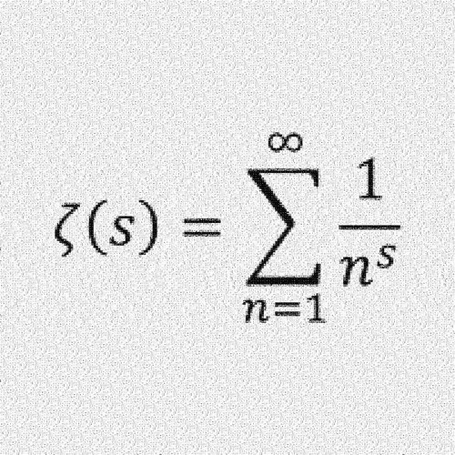
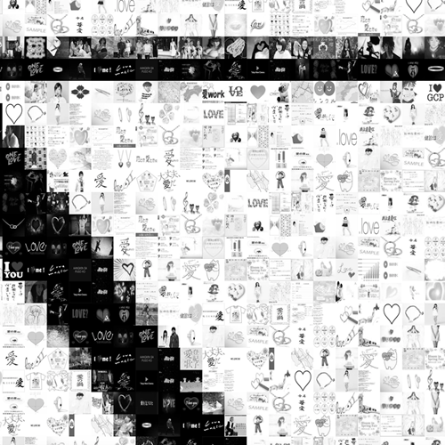

This is the script to convert form keyword to mosaic image.

# Output image like...



# And Detail is...



# workflow

1. you input the keyword and the image.
2. this script finds some images from google-images with the keyword.
3. this script thinks the combination about 10,000 images.
4. this script makes a mosaic image looks like your input image, using by 10,000 images about keyword.
5. you can get the mosaic image.

# Usage

```

$ cd [this script directory]

$ bundle install --path vendor/bundle --binstubs bundle_bin

$ cp [target file] [this script directory]/assets/targets/ # use .jpg file

$ vim main.rb # rewrite keywords for search

$ bundle exec ruby main.rb

```

# Attention

WIP...

# Welcome to pull request

WIP...

* please git commit after `bundle exec "rubocop --auto-gen-config"` and `bundle exec "rubocop --auto-correct"`
